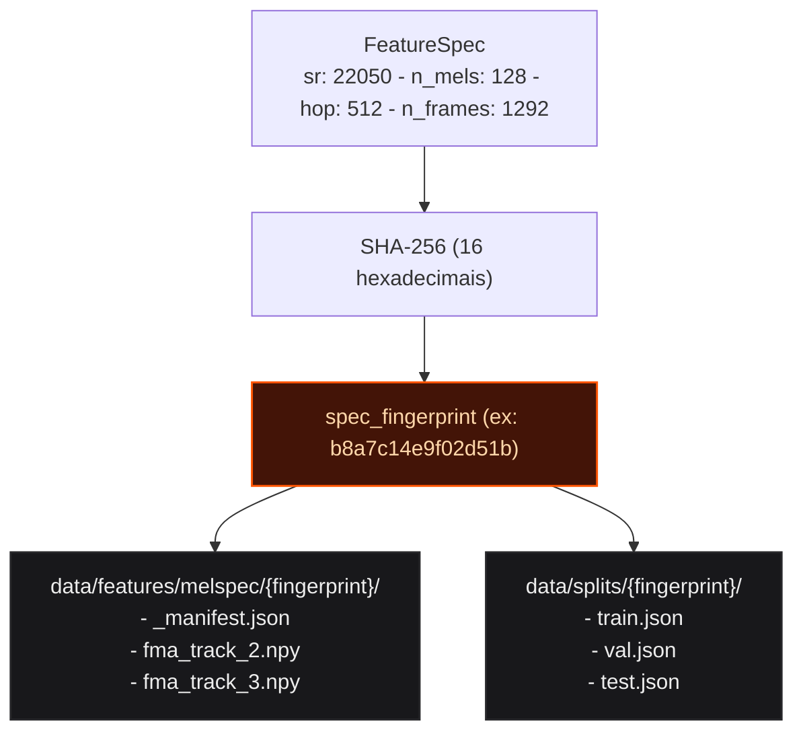

# Contratos Duradouros

Os contratos do Youfy são estruturas de dados e assinaturas desenhadas para resistir a toda a evolução das próximas fases do projeto.

---

## 1. FeatureSpec e Prevenção de Training/Serving Skew

A configuração de featurização viaja incorporada ao artefato do modelo treinado. O servidor de predição (`serving`) valida o `FeatureSpec` do modelo contra o featurizer em tempo de execução:



### Por que Invalidação por Diretório?
Se a taxa de amostragem (`sample_rate`), a quantidade de filtros mel (`n_mels`) ou o `hop_length` mudarem, **nenhum arquivo anterior é deletado ou corrompido**: um novo diretório é criado paralelamente, mantendo o histórico de dados 100% íntegro e permitindo que versões antigas de modelos continuem sendo servidas sem risco de colisão.

```python
@dataclass(frozen=True, slots=True)
class FeatureSpec:
    sample_rate: int = 22050
    n_fft: int = 2048
    hop_length: int = 512
    n_mels: int = 128
    n_frames: int = 1292
    fmin: float = 0.0
    fmax: float | None = None
    top_db: float = 80.0

    @property
    def effective_fmax(self) -> float:
        return self.fmax if self.fmax is not None else self.sample_rate / 2

    def fingerprint(self) -> str:
        payload = json.dumps(asdict(self), sort_keys=True).encode()
        return hashlib.sha256(payload).hexdigest()[:16]
```

---

## 2. Ciclo de Telemetria e Buffer Offline de Eventos

O player pode operar desconectado da rede. Se a API estiver fora do ar, o reprodutor bufferiza os eventos localmente e sincroniza quando a conexão é restabelecida:

```mermaid
sequenceDiagram
    autonumber
    actor User as Usuário / Simulador
    participant Player as Youfy Player
    participant Buffer as Buffer Local (SQLite)
    participant API as FastAPI Server
    participant DB as Postgres (Event Store)

    User->>Player: Inicia reprodução (play_start)
    Player->>Buffer: Grava evento com event_id (UUID) e ts (relógio do cliente)
    
    rect rgb(20, 20, 24)
        Note over Player,API: Se API estiver fora, reprodução segue sem interrupção
        Player--xAPI: POST /events (Falha de conexão)
        Player->>Buffer: Mantém evento no buffer local
    end

    Note over Player,API: API volta a responder
    Player->>API: POST /events (Lote pendente)
    API->>DB: INSERT INTO events ... ON CONFLICT (event_id) DO NOTHING
    DB-->>API: 200 OK (Eventos gravados sem duplicatas)
    API-->>Player: 200 OK
    Player->>Buffer: Limpa eventos sincronizados
```



---

## 3. Schema SQL da Tabela de Eventos

```sql
CREATE TABLE events (
  event_id           UUID PRIMARY KEY,          -- UUID gerado no cliente
  session_id         UUID NOT NULL,
  actor_id           TEXT NOT NULL,             -- 'human:osfarias' ou 'sim:u00412'
  actor_kind         VARCHAR(16) NOT NULL,      -- 'human' ou 'simulated'
  track_id           TEXT NOT NULL REFERENCES tracks(id),
  event_type         VARCHAR(24) NOT NULL,      -- play_start, pause, resume, seek, skip, complete
  ts                 TIMESTAMPTZ NOT NULL,      -- relógio do cliente
  ingested_at        TIMESTAMPTZ NOT NULL,      -- relógio do servidor
  position_ms        INTEGER NOT NULL,
  track_duration_ms  INTEGER NOT NULL,
  client_event_seq   INTEGER NOT NULL,          -- sequência ordinal na sessão
  context            JSONB NOT NULL             -- {"surface": "search", "rank": 1, "model_version": "v1"}
);
```

---

## 4. Superfície da API HTTP

| Método | Rota | Resposta de Sucesso | Modo Degradado / Falha |
|---|---|---|---|
| `GET` | `/tracks?q=&genre=&limit=` | `200 OK` (lista de faixas paginada) | `400 Bad Request` |
| `GET` | `/tracks/{id}` | `200 OK` (metadados e gênero predito) | `404 Not Found` |
| `GET` | `/tracks/{id}/stream` | `206 Partial Content` / `200 OK` | `404 Not Found` |
| `POST` | `/events` | `200 OK` (idempotente por `event_id`) | `422 Unprocessable` |
| `GET` | `/tracks/{id}/genre` | `200 OK` (`distribuição`, `model_version`) | **`503 Service Unavailable`** (sem modelo) |
| `GET` | `/health` | `200 OK` (`status: healthy`, `model_loaded`) | `503 Service Unavailable` |

> [!WARNING]
> A rota `/tracks/{id}/genre` retorna **503 explícito** quando não há modelo em `Production`. Nunca há predição chutada ou fallback silencioso, impedindo contaminação de dados derivados.
