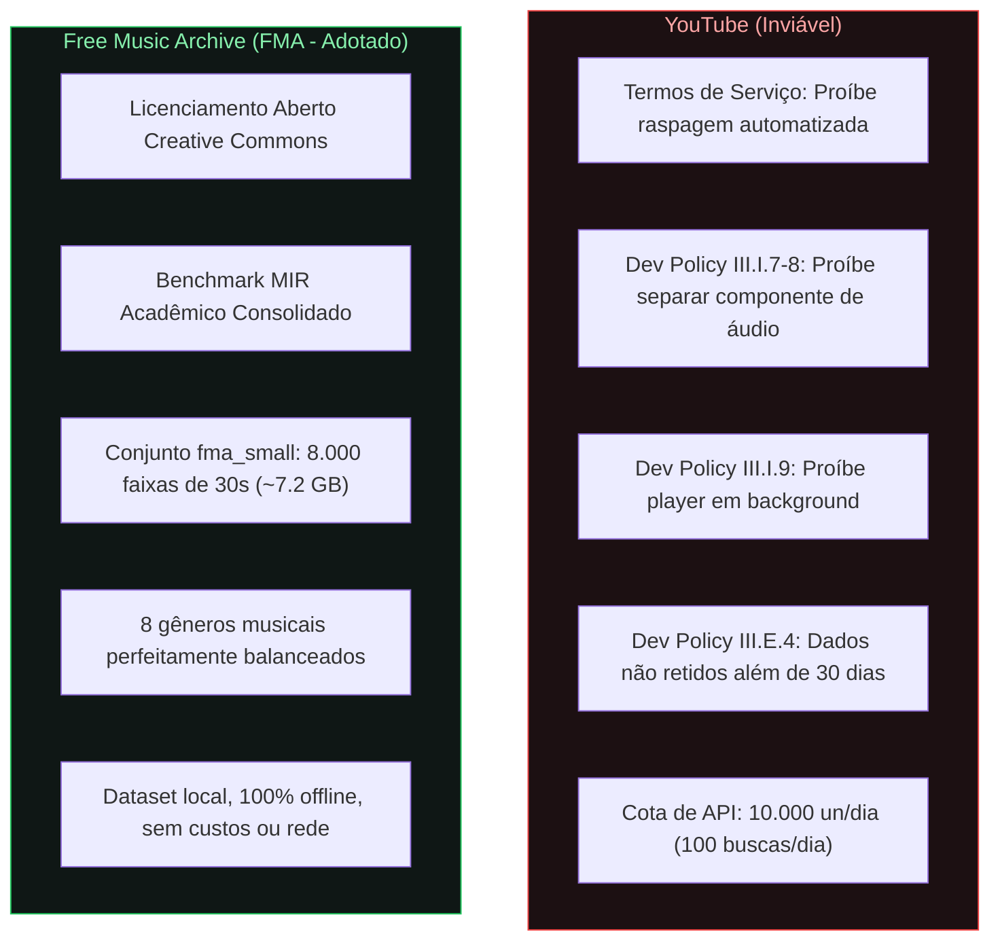
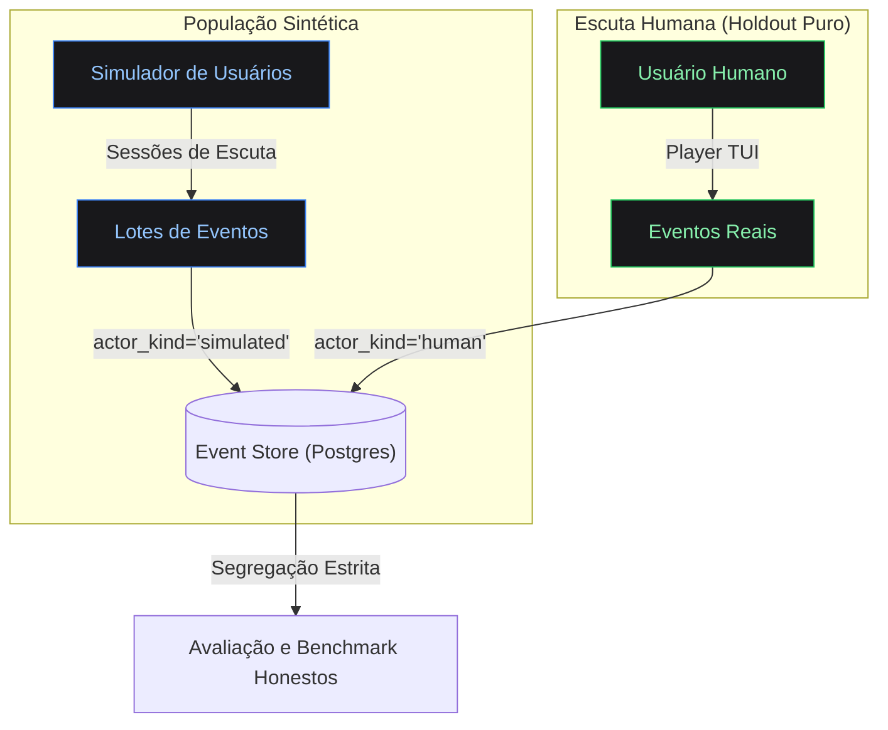
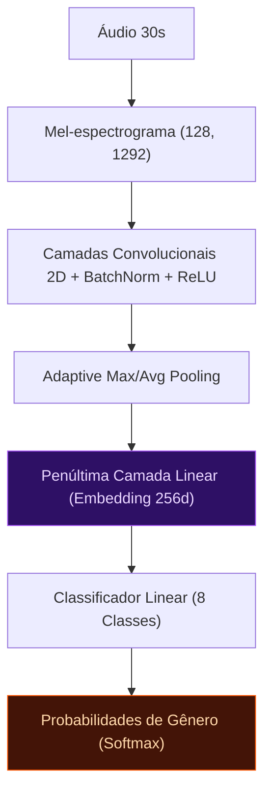
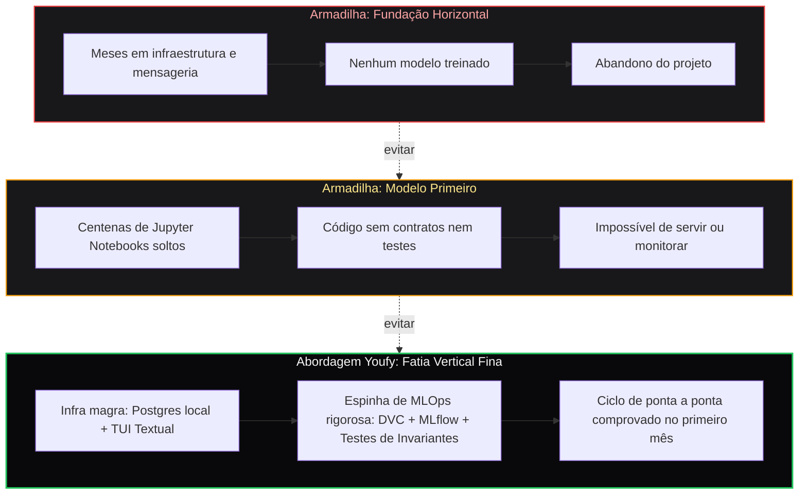

# Decisões Estruturais & Fundamentos de Engenharia

Toda decisão de arquitetura no Youfy foi pensada para priorizar o aprendizado prático e a robustez de MLOps, evitando armadilhas comuns em projetos pessoais de IA.

---

## 1. Fonte de Catálogo: Por que o FMA e não o YouTube?

A concepção preliminar de utilizar raspagem ou APIs do YouTube foi descartada após análise rigorosa dos Termos de Serviço e Políticas de Desenvolvedor da plataforma:

### O que o Free Music Archive (FMA) viabiliza:
- **Reprodução Legal:** Arquivos MP3 armazenados localmente e tocados sem intermediários.
- **Métricas Comparáveis com a Literatura:** Acurácia e Macro-F1 diretamente comparáveis com papers de MIR (*Music Information Retrieval*).
- **Fatia Inicial Balanceada:** O `fma_small` possui exatamente 1.000 faixas para cada um dos 8 gêneros (Electronic, Experimental, Folk, Hip-Hop, Instrumental, International, Pop, Rock).

---

## 2. População Sintética + Holdout Real

Trabalhar com um único usuário humano gera um ciclo de MLOps estatisticamente anêmico:
- Sem potência estatística para testes A/B.
- Impossibilidade de exercitar *bandits* ou recomendação colaborativa.
- Ausência de volume para observar *drift* de distribuição.

> [!IMPORTANT]
> A escuta humana real permanece como **holdout honesto**, nunca misturada com os dados sintéticos. Isso protege o projeto contra o autoengano de validar o simulador com o próprio simulador.

---

## 3. Arquitetura do Primeiro Modelo

Em vez de iniciar por representações auto-supervisionadas difíceis de calibrar ou recomendadores com dados esparsos:
- **Classificador de Gênero Supervisionado:** Rede Convolucional 2D (CNN) sobre mel-espectrogramas.
- **Rótulos Confiáveis:** Herdados da taxonomia de gêneros do FMA.
- **Reaproveitamento de Embeddings:** A penúltima camada da rede servirá diretamente como embedding acústico para o recomendador *content-based* futuro (Spec 3).

---

## 4. Fatia Vertical Fina vs. Fundação Horizontal

