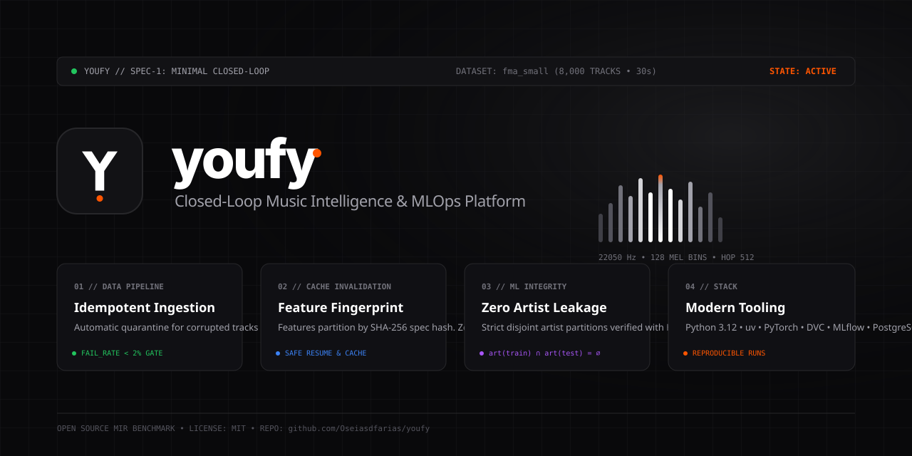

# Identidade Visual & Design System

Esta documentação consolida os princípios de design, identidade visual, componentes de UI/UX, animações acústicas e especificações do reprodutor musical do **Youfy**.

---

## 1. Conceito Central: "Monolith Wave"

A identidade do Youfy é ancorada na união entre o minimalismo industrial suíço (estilo Vercel / Dieter Rams) e o processamento de sinais de áudio de alta precisão:

<div align="center" style="margin: 2rem 0;">
  
</div>

### Elementos do Símbolo
- **Monograma `Y`:** Construído por hastes geométricas de espessura balanceada que evocam a convergência de canais estéreo e nós de processamento.
- **Ponto Âmbar (`#FF5500 Amber Peak`):** Representa o pico de intensidade sonora no espectrograma acústico, conferindo contraste dinâmico à base monocromática.
- **Proporção e Grid:** Concebido sob grid modular de 4px e 8px, garantindo legibilidade perfeita desde 16px (favicon) até outdoors e banners em alta resolução.

---

## 2. Tokens de Design (Design Tokens)

### 2.1 Paleta de Cores

| Token | Dark Mode | Light Mode | Uso Principal |
|---|---|---|---|
| `surface-primary` | `#000000` | `#FFFFFF` | Fundo principal da aplicação |
| `surface-secondary` | `#09090B` | `#FAFAFA` | Cartões, barras laterais e painéis |
| `surface-tertiary` | `#18181B` | `#F4F4F5` | Inputs, blocos de código e tabelas |
| `border-subtle` | `#27272A` | `#E4E4E7` | Linhas divisórias e contornos |
| `text-primary` | `#EDEDED` | `#111111` | Títulos e textos de alto contraste |
| `text-secondary` | `#A1A1AA` | `#71717A` | Metadados técnicos, legendas e rótulos |
| `accent-peak` | `#FF5500` | `#FF5500` | Pico de áudio, status ativo e indicador de volume |
| `status-ok` | `#22C55E` | `#16A34A` | Indicador de saúde, quarentena 0% e predição segura |

### 2.2 Tipografia

- **Interface & Títulos:** `Geist Sans`, `-apple-system`, `BlinkMacSystemFont` (tracking otimizado: `-0.02em`).
- **Código & Metadados Técnicos:** `Geist Mono`, `ui-monospace`, `monospace` (para fingerprints SHA-256, frequências e IDs de faixas).
- **Logotipos & Números:** `Space Grotesk` (geométrica e limpa).

---

## 3. Especificação do Reprodutor Musical (UI/UX)

O player do Youfy não é apenas um reprodutor; é o **consumidor de inferência e emissor de telemetria do sistema de MLOps**.

```
┌────────────────────────────────────────────────────────────────────────┐
│  fma:track:001005 • fma_small                     [ Rock: 94.2% ] ●    │
│  Aura of the Latent Valley                        model_version: v1.2  │
│  Synthetic Artist #14 • Album: Discrete Waveforms                      │
│                                                                        │
│  ▄ ▆ █ ▇ █ ▆ ▄ █ ▇ ▆ ▄ █ ▇ ▅ ▃ ▂ (128-mel melspec visualizer)          │
│  00:14 ─────────────────────────────●────────────────────── -00:16    │
│                                                                        │
│  ⏮   [ ▶ ]   ⏭      ● actor: human:osfarias | surface: search         │
└────────────────────────────────────────────────────────────────────────┘
```

### 3.1 Painel de Predição de ML em Tempo Real
- **Gênero Predito e Confiança:** Exibe a probabilidade calibrada da classe vencedora (ex: `Rock: 94.2%`).
- **`model_version` Obrigatória:** Toda tela do reprodutor indica a versão exata do modelo em execução no `serving`.
- **Modo Degradado (503):** Quando não há modelo promovido para `Production`, o badge exibe `[ No Model 503 ]` em tom neutro, sem fallback falso.

### 3.2 Visualizador de Áudio e Animação de Frequência
A animação do espectrograma utiliza CSS Keyframes sincronizados para simular as bandas de frequência mel (`128-mel bins`):

```css
@keyframes eqBar {
  0%, 100% { height: 18%; }
  50% { height: 95%; }
}

.eq-bar-active {
  animation: eqBar 1.1s ease-in-out infinite;
  background: linear-gradient(to top, #ffffff, #a1a1aa 85%, #ff5500 100%);
}
```

### 3.3 Barra de Telemetria de Eventos
Exibe a emissão atômica dos eventos para o event store:
- `actor_id` (`human:osfarias` ou `sim:u00412`).
- `event_type` (`play_start`, `pause`, `seek`, `skip`, `complete`).
- `context.surface` (`search`, `queue`, `recommendation`).

---

## 4. Adaptação para Terminal TUI (Textual)

Para a implementação da interface em terminal da Spec 1C (`packages/player`):
- **Cores ANSI:** Mapeamento direto de tokens (preto `#09090B` $\rightarrow$ ANSI 232, texto branco $\rightarrow$ ANSI 255, âmbar $\rightarrow$ ANSI 202).
- **Espectrograma ASCII/Unicode:** Uso de caracteres de bloco fracionários (` `, `▂`, `▃`, `▄`, `▅`, `▆`, `▇`, `█`) atualizados pelo tick do player a cada 100ms.
- **Teclas de Atalho:** `Space` (Play/Pause), `j`/`k` (Navegação na lista), `/` (Busca no catálogo), `q` (Sair).

---

## 5. Laboratório Interativo de Design (Showcase)

Explore o laboratório interativo com os três conceitos desenvolvidos, variações de favicon, banners e mockups de interface com alternância de tema Light/Dark:

<div style="border: 1px solid var(--vercel-border-color); border-radius: 12px; overflow: hidden; margin: 1.5rem 0;">
  <iframe src="showcase.html" style="width: 100%; height: 680px; border: none;" title="Youfy Design Lab"></iframe>
</div>

> [!TIP]
> Você também pode abrir o laboratório interativo em tela cheia acessando [showcase.html](showcase.html).
