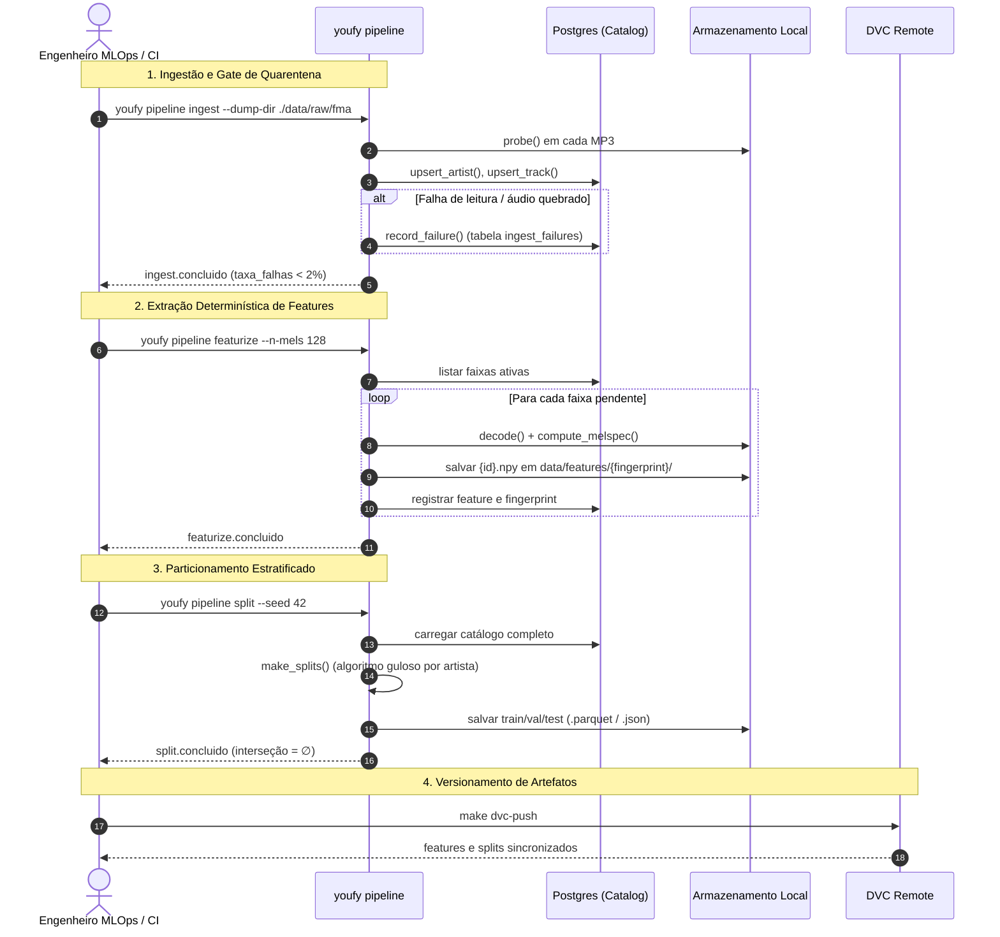

# Pipelines Offline

O Youfy opera três estágios de dados pré-treino. Cada estágio é **idempotente**, **retomável** e pode ser executado de forma isolada.

---

## 1. Estágio `ingest`

Processa o dump do FMA, validando o cabeçalho técnico de cada clipe de áudio via `probe` e salvando o catálogo no Postgres.

```bash
youfy pipeline ingest --dump-dir ./data/raw/fma --subset small --max-failure-rate 0.02
```

### Comportamento de Quarentena
- Falhas em arquivos (mp3 corrompido, arquivo ausente) ou metadados ausentes (sem gênero) são gravados na tabela `ingest_failures`.
- O pipeline não é abortado por causa de faixas isoladas.
- **Gate de integridade:** Se a taxa global de falhas exceder `--max-failure-rate` (default 2%), o comando encerra com código de saída 1.

---

## 2. Estágio `featurize`

Extrai mel-espectrogramas de todas as faixas válidas e salva em arrays NumPy (`.npy`) otimizados para leitura durante o treino.

```bash
youfy pipeline featurize --n-mels 128 --hop-length 512 --n-frames 1292
```

### Características
- **Cache e Retomada:** Se o processo for interrompido e executado novamente, faixas já computadas são identificadas pela existência do arquivo `.npy` e ignoradas (`skipped`).
- **Isolamento por Fingerprint:** Salva em `data/features/melspec/<fingerprint>/` junto a um `_manifest.json` com os hiperparâmetros utilizados.

---

## 3. Estágio `split`

Gera partições determinísticas (`train.json`, `val.json`, `test.json`) para alimentar os DataLoaders de treino.

```bash
youfy pipeline split --seed 42
```

### Características
- **Disjunção estrita de artistas:** Nenhum artista tem faixas divididas entre conjuntos distintos.
- **Estratificação por gênero:** Mantém o equilíbrio entre classes em todos os splits.
- Salva o resultado em `data/splits/<fingerprint>/`.

---

## Ciclo de Vida Completo do Dado Offline



