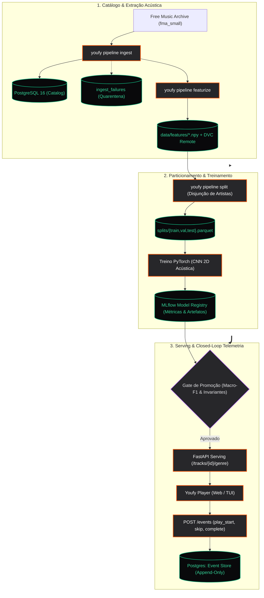

<!-- ANIMATED INTERACTIVE HERO BANNER -->
<div class="youfy-hero-banner">
  <!-- Subtle Grid & Ambient Glow -->
  <div class="youfy-hero-grid"></div>
  <div class="youfy-hero-glow"></div>
  
  <!-- Waveform Animation Canvas -->
  <canvas id="youfy-hero-canvas" class="youfy-hero-canvas"></canvas>

  <!-- Top Metadata Bar -->
  <div style="position: relative; z-index: 2; display: flex; align-items: center; justify-content: space-between; flex-wrap: wrap; gap: 0.5rem;">
    <div class="youfy-hero-badge">
      <span class="status-dot"></span>
      <span style="color: #ffffff; font-weight: 600;">YOUFY // MLOps Platform</span>
      <span style="color: #52525b;">•</span>
      <span>Dataset: fma_small</span>
    </div>
    <div style="display: flex; gap: 0.4rem; font-family: var(--md-font-code); font-size: 0.72rem;">
      <span style="padding: 0.2rem 0.55rem; border-radius: 4px; background: rgba(255, 85, 0, 0.15); border: 1px solid rgba(255, 85, 0, 0.3); color: #ff7733; font-weight: 600;">SPEC-1 CLOSED-LOOP</span>
      <span style="padding: 0.2rem 0.55rem; border-radius: 4px; background: rgba(39, 39, 42, 0.6); border: 1px solid rgba(255, 255, 255, 0.08); color: #d4d4d8;">SHA-256 FINGERPRINT</span>
    </div>
  </div>

  <!-- Main Identity (Monolith Wave Concept) -->
  <div style="position: relative; z-index: 2; margin: 1.5rem 0 1rem 0; display: flex; align-items: center; gap: 1.25rem; flex-wrap: wrap;">
    <div class="youfy-hero-logo-box">
      <svg width="34" height="34" viewBox="0 0 40 40" fill="none" xmlns="http://www.w3.org/2000/svg">
        <path d="M12 11L18 20V29H22V20L28 11H23.5L20 16.8L16.5 11H12Z" fill="white"/>
        <circle cx="20" cy="33" r="1.8" fill="#FF5500"/>
      </svg>
    </div>
    <div>
      <div class="youfy-hero-brand">
        youfy<span style="color: #ff5500;">.</span>
      </div>
      <div class="youfy-hero-sub">
        Closed-Loop Music Intelligence &amp; Acoustic DSP Architecture
      </div>
    </div>
  </div>

  <!-- Bottom Interactive Bar & Equalizer -->
  <div style="position: relative; z-index: 2; display: flex; align-items: flex-end; justify-content: space-between; flex-wrap: wrap; gap: 1rem; border-top: 1px solid rgba(255, 255, 255, 0.08); padding-top: 0.85rem;">
    <div style="display: flex; align-items: center; gap: 0.75rem;">
      <div class="youfy-hero-bars" id="hero-bars">
        <div class="youfy-hero-bar" style="height: 35%;"></div>
        <div class="youfy-hero-bar" style="height: 60%;"></div>
        <div class="youfy-hero-bar" style="height: 85%;"></div>
        <div class="youfy-hero-bar" style="height: 45%;"></div>
        <div class="youfy-hero-bar accent" style="height: 95%;"></div>
        <div class="youfy-hero-bar" style="height: 70%;"></div>
        <div class="youfy-hero-bar" style="height: 40%;"></div>
        <div class="youfy-hero-bar" style="height: 80%;"></div>
        <div class="youfy-hero-bar" style="height: 55%;"></div>
        <div class="youfy-hero-bar" style="height: 90%;"></div>
        <div class="youfy-hero-bar" style="height: 30%;"></div>
        <div class="youfy-hero-bar" style="height: 75%;"></div>
      </div>
      <span style="font-family: var(--md-font-code); font-size: 0.72rem; color: #71717a;">128-mel spectrogram buffer</span>
    </div>

    <div style="font-family: var(--md-font-code); font-size: 0.72rem; color: #a1a1aa; display: flex; gap: 1rem;">
      <span>pytorch</span>
      <span style="color: #52525b;">•</span>
      <span>dvc</span>
      <span style="color: #52525b;">•</span>
      <span>mlflow</span>
      <span style="color: #52525b;">•</span>
      <span>postgres</span>
    </div>
  </div>
</div>

<script>
(function() {
  // Animated Hero Waveform Canvas
  const canvas = document.getElementById('youfy-hero-canvas');
  if (!canvas) return;
  const ctx = canvas.getContext('2d');
  let animationId;
  let phase = 0;

  function resizeCanvas() {
    canvas.width = canvas.parentElement.clientWidth;
    canvas.height = canvas.parentElement.clientHeight;
  }
  window.addEventListener('resize', resizeCanvas);
  resizeCanvas();

  function drawHeroWaves() {
    ctx.clearRect(0, 0, canvas.width, canvas.height);
    const w = canvas.width;
    const h = canvas.height;
    const midY = h * 0.68;

    // Draw secondary subtle wave (ambient noise)
    ctx.beginPath();
    ctx.lineWidth = 1.2;
    ctx.strokeStyle = 'rgba(255, 255, 255, 0.08)';
    for (let x = 0; x < w; x += 3) {
      const y = midY + Math.sin(x * 0.015 + phase * 0.7) * 16 + Math.sin(x * 0.03 - phase * 0.4) * 8;
      if (x === 0) ctx.moveTo(x, y);
      else ctx.lineTo(x, y);
    }
    ctx.stroke();

    // Draw primary acoustic sine wave
    ctx.beginPath();
    ctx.lineWidth = 2;
    const grad = ctx.createLinearGradient(0, 0, w, 0);
    grad.addColorStop(0, 'rgba(255, 255, 255, 0.1)');
    grad.addColorStop(0.5, 'rgba(255, 255, 255, 0.65)');
    grad.addColorStop(0.85, 'rgba(255, 85, 0, 0.85)');
    grad.addColorStop(1, 'rgba(255, 85, 0, 0.2)');
    ctx.strokeStyle = grad;

    for (let x = 0; x < w; x += 3) {
      const amp = (Math.sin(x * 0.006 + phase) * 0.5 + 0.5) * 28 + 4;
      const y = midY + Math.sin(x * 0.02 + phase * 1.4) * amp;
      if (x === 0) ctx.moveTo(x, y);
      else ctx.lineTo(x, y);
    }
    ctx.stroke();

    // Animate equalizer bars in hero
    const bars = document.querySelectorAll('#hero-bars .youfy-hero-bar');
    if (bars && bars.length > 0) {
      bars.forEach((bar, idx) => {
        const val = 20 + Math.abs(Math.sin(phase * 1.8 + idx * 0.6)) * 75;
        bar.style.height = val + '%';
      });
    }

    phase += 0.035;
    animationId = requestAnimationFrame(drawHeroWaves);
  }

  drawHeroWaves();
})();
</script>

# Youfy — Laboratório de IA & Player de Áudio

O **Youfy** é um ecossistema musical de alta fidelidade desenvolvido como laboratório prático de Inteligência Artificial aplicada e MLOps. O player existe para dar carga real aos modelos; os modelos e seu ciclo de vida completo são o objetivo central.

---

## Demonstração Interativa do Reprodutor Acústico

Experimente abaixo o reprodutor musical integrado com o componente de inferência de Machine Learning. Clique em **Reproduzir Áudio** para escutar a síntese sonora em tempo real via Web Audio API e observar a telemetria e o espectrograma animado:

<div class="youfy-player-card">
  <!-- Track Header & ML Prediction -->
  <div style="display: flex; justify-content: space-between; align-items: flex-start; margin-bottom: 1.25rem; flex-wrap: wrap; gap: 0.75rem;">
    <div>
      <span style="font-family: var(--md-font-code); font-size: 0.7rem; padding: 0.2rem 0.5rem; border-radius: 4px; background: rgba(255, 255, 255, 0.06); border: 1px solid rgba(255, 255, 255, 0.1); color: #a1a1aa; text-transform: uppercase;">
        fma:track:001005 • fma_small
      </span>
      <h3 style="margin: 0.4rem 0 0.1rem 0; font-size: 1.35rem; font-weight: 700; letter-spacing: -0.02em; color: #ffffff;">
        Aura of the Latent Valley
      </h3>
      <p style="margin: 0; font-size: 0.82rem; color: #a1a1aa;">
        Synthetic Artist #14 • Album: Discrete Waveforms
      </p>
    </div>

    <!-- Live ML Prediction Badge -->
    <div style="text-align: right;">
      <div style="display: inline-flex; align-items: center; gap: 0.4rem; padding: 0.35rem 0.75rem; border-radius: 6px; background: rgba(24, 24, 27, 0.9); border: 1px solid rgba(255, 255, 255, 0.12); font-family: var(--md-font-code); font-size: 0.8rem; font-weight: 600; color: #ffffff;">
        <span style="width: 7px; height: 7px; border-radius: 50%; background: #22c55e; box-shadow: 0 0 6px rgba(34, 197, 94, 0.8);"></span>
        <span>Rock: 94.2%</span>
      </div>
      <div style="font-family: var(--md-font-code); font-size: 0.7rem; color: #71717a; margin-top: 0.25rem;">
        model_version: clf-v1.2
      </div>
    </div>
  </div>

  <!-- Real Spectrogram Waveform Bars (Web Audio FFT Powered) -->
  <div style="space-y: 0.5rem; margin-bottom: 1.25rem;">
    <div class="youfy-player-waveform" style="padding: 0; background: #050507;">
      <canvas id="youfy-player-fft-canvas" class="youfy-fft-canvas" height="68"></canvas>
    </div>
    <div style="display: flex; justify-content: space-between; font-family: var(--md-font-code); font-size: 0.72rem; color: #71717a; margin-top: 0.4rem;">
      <span id="player-time">00:14</span>
      <span>-00:16 (30s FMA clip)</span>
    </div>
  </div>

  <!-- Controls Bar & Telemetry Indicator -->
  <div style="display: flex; justify-content: space-between; align-items: center; border-top: 1px solid rgba(255, 255, 255, 0.08); padding-top: 1rem; flex-wrap: wrap; gap: 1rem;">
    <!-- Large Prominent Play Button -->
    <button class="youfy-play-btn-hero" id="btn-player-play" onclick="togglePlaySynth()" title="Reproduzir / Pausar Áudio">
      <span id="player-play-icon" style="font-size: 1.35rem; line-height: 1; display: inline-flex; align-items: center;">▶</span>
      <span id="player-play-text" style="letter-spacing: -0.01em; font-size: 1rem;">Reproduzir Áudio</span>
    </button>

    <!-- Telemetry Indicator -->
    <div style="display: flex; align-items: center; gap: 0.5rem; font-family: var(--md-font-code); font-size: 0.75rem; color: #a1a1aa;">
      <span style="width: 7px; height: 7px; border-radius: 50%; background: #22c55e; box-shadow: 0 0 8px rgba(34, 197, 94, 0.8);"></span>
      <span>actor: <strong style="color: #ffffff;">human:osfarias</strong></span>
      <span style="color: #52525b;">|</span>
      <span>surface: <strong style="color: #ffffff;">search</strong></span>
    </div>
  </div>
</div>

<script>
let audioCtx = null;
let analyser = null;
let masterGain = null;
let isPlaying = false;
let synthTimer = null;
let animFrameId = null;
let currentSeconds = 14;
const totalSeconds = 30;

// Canvas setup
const pCanvas = document.getElementById('youfy-player-fft-canvas');
const pCtx = pCanvas ? pCanvas.getContext('2d') : null;

function resizePlayerCanvas() {
  if (!pCanvas) return;
  pCanvas.width = pCanvas.parentElement.clientWidth;
  pCanvas.height = 68;
}
window.addEventListener('resize', resizePlayerCanvas);
resizePlayerCanvas();

// Render static preview when idle
function drawPlayerIdle() {
  if (!pCtx || isPlaying) return;
  const w = pCanvas.width;
  const h = pCanvas.height;
  pCtx.clearRect(0, 0, w, h);

  const numBars = 32;
  const barGap = 3;
  const barWidth = Math.max(3, (w - (numBars - 1) * barGap) / numBars);
  const currentIdx = Math.floor((currentSeconds / totalSeconds) * numBars);

  const mockHeights = [
    0.22, 0.35, 0.48, 0.62, 0.40, 0.75, 0.90, 0.55,
    0.85, 0.98, 0.65, 0.50, 0.80, 0.92, 0.60, 0.42,
    0.70, 0.52, 0.65, 0.82, 0.38, 0.50, 0.32, 0.58,
    0.45, 0.28, 0.36, 0.20, 0.30, 0.45, 0.25, 0.18
  ];

  for (let i = 0; i < numBars; i++) {
    const bh = Math.max(4, mockHeights[i % mockHeights.length] * (h - 10));
    const x = i * (barWidth + barGap);
    const y = h - bh;

    if (i < currentIdx) {
      pCtx.fillStyle = 'rgba(255, 255, 255, 0.85)';
      pCtx.shadowBlur = 0;
    } else if (i === currentIdx) {
      pCtx.fillStyle = '#ff5500';
      pCtx.shadowColor = '#ff5500';
      pCtx.shadowBlur = 8;
    } else {
      pCtx.fillStyle = 'rgba(255, 255, 255, 0.2)';
      pCtx.shadowBlur = 0;
    }

    pCtx.beginPath();
    pCtx.roundRect(x, y, barWidth, bh, [2, 2, 0, 0]);
    pCtx.fill();
  }
}
setTimeout(drawPlayerIdle, 50);

function togglePlaySynth() {
  if (isPlaying) {
    stopSynth();
  } else {
    startSynth();
  }
}

function startSynth() {
  try {
    const AudioContext = window.AudioContext || window.webkitAudioContext;
    if (!audioCtx) {
      audioCtx = new AudioContext();
      analyser = audioCtx.createAnalyser();
      analyser.fftSize = 64; // Produces 32 real frequency bins
      analyser.smoothingTimeConstant = 0.75;

      masterGain = audioCtx.createGain();
      masterGain.gain.setValueAtTime(0.3, audioCtx.currentTime);
      masterGain.connect(analyser);
      analyser.connect(audioCtx.destination);
    }

    if (audioCtx.state === 'suspended') audioCtx.resume();

    isPlaying = true;
    document.getElementById('player-play-icon').textContent = '❚❚';
    const textEl = document.getElementById('player-play-text');
    if (textEl) textEl.textContent = 'Pausar Áudio';

    // Rich polyphonic arpeggio sequence
    const notes = [
      220.0, 261.63, 329.63, 440.0,  // Am arpeggio
      329.63, 392.0, 493.88, 523.25, // Em / C harmonics
      349.23, 440.0, 523.25, 659.25  // F maj7 chord tones
    ];
    let noteIdx = 0;

    function playSynthNote() {
      if (!isPlaying) return;
      const osc = audioCtx.createOscillator();
      const osc2 = audioCtx.createOscillator();
      const noteGain = audioCtx.createGain();

      const freq = notes[noteIdx % notes.length];
      noteIdx++;

      osc.type = 'sawtooth';
      osc.frequency.setValueAtTime(freq, audioCtx.currentTime);

      osc2.type = 'triangle';
      osc2.frequency.setValueAtTime(freq * 0.5, audioCtx.currentTime); // Sub-bass octave

      const now = audioCtx.currentTime;
      noteGain.gain.setValueAtTime(0.18, now);
      noteGain.gain.exponentialRampToValueAtTime(0.001, now + 0.32);

      osc.connect(noteGain);
      osc2.connect(noteGain);
      noteGain.connect(masterGain);

      osc.start(now);
      osc2.start(now);
      osc.stop(now + 0.35);
      osc2.stop(now + 0.35);
    }

    synthTimer = setInterval(() => {
      playSynthNote();
      currentSeconds += 0.2;
      if (currentSeconds >= totalSeconds) currentSeconds = 0;
      
      const mins = Math.floor(currentSeconds / 60);
      const secs = Math.floor(currentSeconds % 60);
      document.getElementById('player-time').textContent = 
        String(mins).padStart(2, '0') + ':' + String(secs).padStart(2, '0');
    }, 200);

    // FFT Real-time animation loop via requestAnimationFrame
    const bufferLength = analyser.frequencyBinCount; // 32 frequency bins
    const dataArray = new Uint8Array(bufferLength);

    function renderFFT() {
      if (!isPlaying) return;
      analyser.getByteFrequencyData(dataArray);

      const w = pCanvas.width;
      const h = pCanvas.height;
      pCtx.clearRect(0, 0, w, h);

      const barGap = 3;
      const barWidth = Math.max(3, (w - (bufferLength - 1) * barGap) / bufferLength);
      const progressIdx = Math.floor((currentSeconds / totalSeconds) * bufferLength);

      for (let i = 0; i < bufferLength; i++) {
        const binValue = dataArray[i];
        // Calculate bar height with dynamic amplification
        const rawHeight = (binValue / 255) * (h - 8);
        const bh = Math.max(4, rawHeight);
        const x = i * (barWidth + barGap);
        const y = h - bh;

        if (i < progressIdx) {
          pCtx.fillStyle = 'rgba(255, 255, 255, 0.95)';
          pCtx.shadowBlur = 0;
        } else if (i === progressIdx) {
          pCtx.fillStyle = '#ff5500';
          pCtx.shadowColor = '#ff5500';
          pCtx.shadowBlur = 12;
        } else {
          // Future unplayed bars pulse with softer ambient level
          const softAlpha = 0.15 + (binValue / 255) * 0.35;
          pCtx.fillStyle = `rgba(255, 255, 255, ${softAlpha.toFixed(2)})`;
          pCtx.shadowBlur = 0;
        }

        pCtx.beginPath();
        pCtx.roundRect(x, y, barWidth, bh, [2, 2, 0, 0]);
        pCtx.fill();
      }

      animFrameId = requestAnimationFrame(renderFFT);
    }

    renderFFT();

  } catch (err) {
    console.error('Audio synthesis failed:', err);
  }
}

function stopSynth() {
  isPlaying = false;
  if (synthTimer) clearInterval(synthTimer);
  if (animFrameId) cancelAnimationFrame(animFrameId);
  document.getElementById('player-play-icon').textContent = '▶';
  const textEl = document.getElementById('player-play-text');
  if (textEl) textEl.textContent = 'Reproduzir Áudio';
  setTimeout(drawPlayerIdle, 100);
}

function prevTrack() {
  currentSeconds = 0;
  document.getElementById('player-time').textContent = '00:00';
  drawPlayerIdle();
}

function nextTrack() {
  currentSeconds = 0;
  document.getElementById('player-time').textContent = '00:00';
  drawPlayerIdle();
}
</script>

---

## Arquitetura de Ponta a Ponta

O Youfy implementa um ciclo de dados unidirecional e rigoroso:



---

## Pilares do Sistema

<div class="grid cards" markdown>

-   :material-waveform: **Processamento Puro de Áudio**

    ---

    O pacote [`youfy-audio`](pacotes/audio.md) opera como funções puras sobre arrays (sem banco de dados nem rede), testável via sinais senoidais analíticos de 440 Hz e silêncio.

-   :material-database: **Catálogo Resiliente com Quarentena**

    ---

    O [`youfy-catalog`](pacotes/catalog.md) persiste o acervo com modelos SQLAlchemy 2.0 e isola faixas corrompidas na tabela `ingest_failures`, garantindo que 8 mil faixas sejam processadas sem travamentos.

-   :material-shuffle-variant: **Disjunção de Artista por Construção**

    ---

    O algoritmo guloso por déficit em [`youfy-pipelines`](pacotes/pipelines.md) impede matematicamente que o mesmo artista apareça no treino e no teste ($\text{artistas}(\text{train}) \cap \text{artistas}(\text{test}) = \emptyset$).

-   :material-lock-check: **Versionamento Estrito DVC**

    ---

    Matrizes `.npy` e partições JSON são rastreadas via **DVC**, permitindo restauração exata e reprodutibilidade de qualquer experimento histórico.

</div>

---

## Começando em 2 Minutos

```bash
# 1. Configurar workspace monorepo determinístico
make setup

# 2. Inicializar banco Postgres 16 local
make up

# 3. Executar toda a suíte de testes (45 testes unitários + 2 e2e)
make test
make e2e

# 4. Iniciar servidor de documentação com live-reload
make docs-serve
```

Consulte o [Guia de Início Rápido](guia/inicio-rapido.md) para instruções detalhadas.
