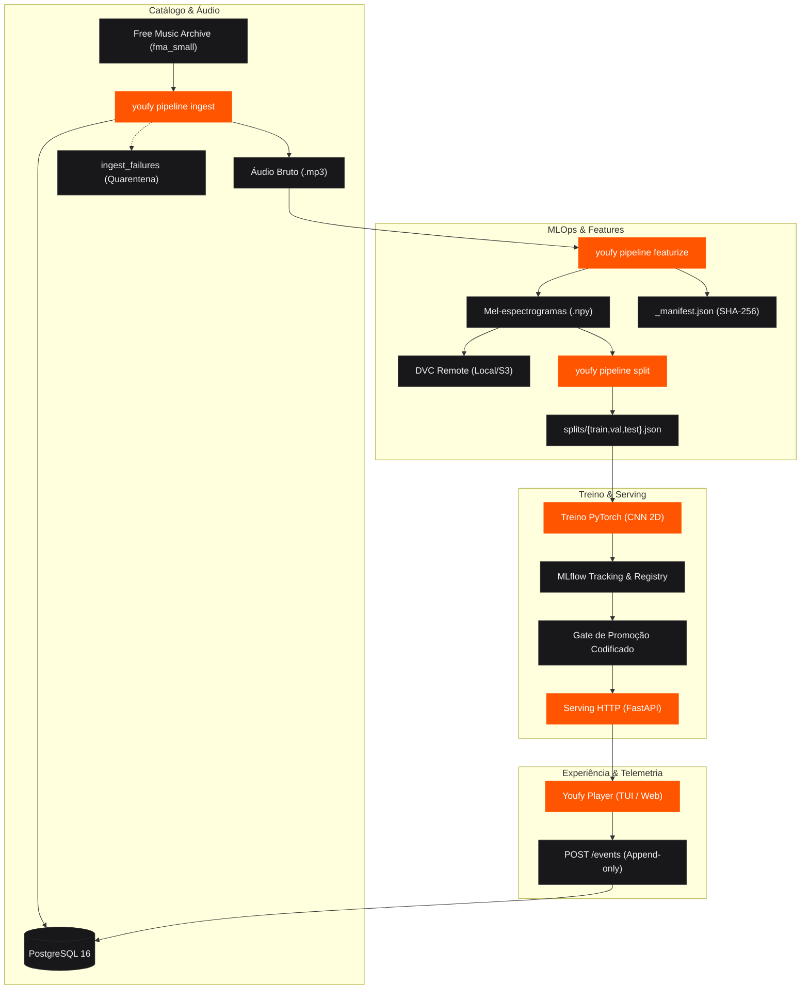

<div align="center" style="margin-bottom: 2rem;">


<div style="margin-top: 1.25rem; display: flex; justify-content: center; gap: 0.5rem; flex-wrap: wrap;">
  <span style="font-family: var(--md-font-code); font-size: 0.75rem; padding: 0.2rem 0.6rem; border-radius: 9999px; background: var(--vercel-card-bg); border: 1px solid var(--vercel-border-color); color: var(--md-default-fg-color);">Dataset: Free Music Archive (fma_small)</span>
  <span style="font-family: var(--md-font-code); font-size: 0.75rem; padding: 0.2rem 0.6rem; border-radius: 9999px; background: var(--vercel-card-bg); border: 1px solid var(--vercel-border-color); color: #22c55e;">Status: CI &amp; E2E Verified</span>
  <span style="font-family: var(--md-font-code); font-size: 0.75rem; padding: 0.2rem 0.6rem; border-radius: 9999px; background: var(--vercel-card-bg); border: 1px solid var(--vercel-border-color); color: #ff5500;">Closed-Loop MLOps</span>
</div>

</div>

# Youfy — Laboratório de IA & Player de Áudio

O **Youfy** é um ecossistema musical de alta fidelidade desenvolvido como laboratório prático de Inteligência Artificial aplicada e MLOps. O player existe para dar carga real aos modelos; os modelos e seu ciclo de vida completo são o objetivo central.

---

## Demonstração Interativa do Reprodutor Acústico

Experimente abaixo o reprodutor musical integrado com o componente de inferência de Machine Learning. Clique em **Reproduzir Áudio** para escutar a síntese sonora em tempo real via Web Audio API e observar a telemetria e o espectrograma animado:

<div class="youfy-player-card">
  <!-- Track Header & ML Prediction -->
  <div style="display: flex; justify-content: space-between; align-items: flex-start; margin-bottom: 1.25rem; flex-wrap: wrap; gap: 0.75rem;">
    <div>
      <span style="font-family: var(--md-font-code); font-size: 0.72rem; padding: 0.2rem 0.5rem; border-radius: 4px; background: var(--md-default-bg-color--lighter); border: 1px solid var(--vercel-border-color); color: var(--md-default-fg-color--light);">
        fma:track:001005 • subset: small
      </span>
      <h3 style="margin: 0.4rem 0 0.1rem 0; font-size: 1.35rem; font-weight: 700; letter-spacing: -0.02em;">
        Aura of the Latent Valley
      </h3>
      <p style="margin: 0; font-size: 0.82rem; color: var(--md-default-fg-color--light);">
        Artista Sintético #14 • Álbum: Discrete Waveforms
      </p>
    </div>

    <!-- Live ML Inference Tag -->
    <div style="text-align: right;">
      <div style="display: inline-flex; align-items: center; gap: 0.4rem; padding: 0.35rem 0.75rem; border-radius: 6px; background: var(--md-default-bg-color); border: 1px solid var(--vercel-border-color); font-family: var(--md-font-code); font-size: 0.8rem; font-weight: 600;">
        <span style="width: 8px; height: 8px; border-radius: 50%; background: #22c55e;"></span>
        <span>Rock: 94.2%</span>
      </div>
      <div style="font-family: var(--md-font-code); font-size: 0.7rem; color: var(--md-default-fg-color--lighter); margin-top: 0.25rem;">
        model_version: clf-v1.2 (PyTorch CNN)
      </div>
    </div>
  </div>

  <!-- Animated Frequency Bars & Waveform Canvas -->
  <div style="background: var(--md-default-bg-color); border: 1px solid var(--vercel-border-color); border-radius: 8px; padding: 1rem; margin-bottom: 1rem;">
    <div style="display: flex; align-items: flex-end; justify-content: space-between; height: 64px; gap: 3px; overflow: hidden; padding-bottom: 4px;" id="eq-container">
      <div class="youfy-eq-bar" style="height: 25%;"></div>
      <div class="youfy-eq-bar" style="height: 45%;"></div>
      <div class="youfy-eq-bar" style="height: 70%;"></div>
      <div class="youfy-eq-bar" style="height: 30%;"></div>
      <div class="youfy-eq-bar" style="height: 85%;"></div>
      <div class="youfy-eq-bar" style="height: 60%;"></div>
      <div class="youfy-eq-bar" style="height: 90%;"></div>
      <div class="youfy-eq-bar" style="height: 40%;"></div>
      <div class="youfy-eq-bar" style="height: 75%; background: #ff5500;"></div>
      <div class="youfy-eq-bar" style="height: 55%;"></div>
      <div class="youfy-eq-bar" style="height: 80%;"></div>
      <div class="youfy-eq-bar" style="height: 35%;"></div>
      <div class="youfy-eq-bar" style="height: 65%;"></div>
      <div class="youfy-eq-bar" style="height: 95%;"></div>
      <div class="youfy-eq-bar" style="height: 50%;"></div>
      <div class="youfy-eq-bar" style="height: 20%;"></div>
    </div>
    
    <!-- Progress & Scrub Bar -->
    <div style="display: flex; align-items: center; justify-content: space-between; font-family: var(--md-font-code); font-size: 0.72rem; color: var(--md-default-fg-color--lighter); margin-top: 0.5rem;">
      <span id="player-time">00:00</span>
      <div style="flex-grow: 1; height: 4px; background: var(--md-default-bg-color--lighter); border-radius: 2px; margin: 0 0.75rem; position: relative; overflow: hidden;">
        <div id="player-progress" style="width: 0%; height: 100%; background: var(--md-default-fg-color); transition: width 0.2s linear;"></div>
      </div>
      <span>00:30 (FMA Clip)</span>
    </div>
  </div>

  <!-- Player Controls & Telemetry -->
  <div style="display: flex; justify-content: space-between; align-items: center; flex-wrap: wrap; gap: 1rem;">
    <div style="display: flex; align-items: center; gap: 0.75rem;">
      <button id="btn-play-pause" onclick="togglePlaySynth()" style="display: inline-flex; align-items: center; gap: 0.5rem; padding: 0.5rem 1.25rem; border-radius: 6px; background: var(--md-default-fg-color); color: var(--md-default-bg-color); font-weight: 600; font-size: 0.85rem; border: none; cursor: pointer;">
        <span id="play-icon">▶</span> <span id="play-text">Tocar Áudio Sintético</span>
      </button>
      <span style="font-family: var(--md-font-code); font-size: 0.75rem; color: var(--md-default-fg-color--lighter);">
        22.05 kHz • 128 mel bins • ref=1.0
      </span>
    </div>

    <!-- Live Telemetry Status -->
    <div style="font-family: var(--md-font-code); font-size: 0.72rem; color: var(--md-default-fg-color--light); display: flex; align-items: center; gap: 0.5rem;">
      <span style="width: 6px; height: 6px; border-radius: 50%; background: #22c55e;"></span>
      <span>telemetry: <strong>POST /events</strong> (play_start)</span>
      <span style="color: var(--md-default-fg-color--lighter);">|</span>
      <span>actor: <strong>human:osfarias</strong></span>
    </div>
  </div>
</div>

<script>
let audioCtx = null;
let isPlaying = false;
let synthTimer = null;
let currentSeconds = 0;
const totalSeconds = 30;

function togglePlaySynth() {
  if (isPlaying) {
    stopSynth();
  } else {
    startSynth();
  }
}

function startSynth() {
  try {
    const AudioContext = window.AudioContext || window.webkitAudioContext;
    if (!audioCtx) audioCtx = new AudioContext();
    if (audioCtx.state === 'suspended') audioCtx.resume();

    isPlaying = true;
    document.getElementById('play-icon').textContent = '❚❚';
    document.getElementById('play-text').textContent = 'Pausar Áudio';

    // Animate equalizer bars
    const bars = document.querySelectorAll('.youfy-eq-bar');
    bars.forEach((bar, idx) => {
      bar.classList.add('active-' + ((idx % 8) + 1));
    });

    // Play chord progression (A minor synth chord arpeggio)
    const notes = [220.0, 261.63, 329.63, 440.0, 329.63, 261.63, 392.0, 493.88];
    let noteIdx = 0;

    function playNote() {
      if (!isPlaying) return;
      const osc = audioCtx.createOscillator();
      const gain = audioCtx.createGain();
      
      osc.type = 'triangle';
      osc.frequency.setValueAtTime(notes[noteIdx % notes.length], audioCtx.currentTime);
      noteIdx++;

      gain.gain.setValueAtTime(0.12, audioCtx.currentTime);
      gain.gain.exponentialRampToValueAtTime(0.001, audioCtx.currentTime + 0.35);

      osc.connect(gain);
      gain.connect(audioCtx.destination);

      osc.start();
      osc.stop(audioCtx.currentTime + 0.38);
    }

    synthTimer = setInterval(() => {
      playNote();
      currentSeconds += 0.25;
      if (currentSeconds >= totalSeconds) currentSeconds = 0;
      
      const mins = Math.floor(currentSeconds / 60);
      const secs = Math.floor(currentSeconds % 60);
      document.getElementById('player-time').textContent = 
        String(mins).padStart(2, '0') + ':' + String(secs).padStart(2, '0');
      
      const pct = (currentSeconds / totalSeconds) * 100;
      document.getElementById('player-progress').style.width = pct + '%';
    }, 250);

  } catch (err) {
    console.error('Audio synthesis failed:', err);
  }
}

function stopSynth() {
  isPlaying = false;
  if (synthTimer) clearInterval(synthTimer);
  document.getElementById('play-icon').textContent = '▶';
  document.getElementById('play-text').textContent = 'Tocar Áudio Sintético';

  const bars = document.querySelectorAll('.youfy-eq-bar');
  bars.forEach((bar, idx) => {
    bar.className = 'youfy-eq-bar';
  });
}
</script>

---

## Arquitetura de Ponta a Ponta

O Youfy implementa um ciclo de dados unidirecional e rigoroso:



---

## Pilares do Sistema

<div class="grid cards" markdown>

-   :material-waveform: **Processamento Puro de Áudio**

    ---

    O pacote [`youfy-audio`](pacotes/audio/) opera como funções puras sobre arrays (sem banco de dados nem rede), testável via sinais senoidais analíticos de 440 Hz e silêncio.

-   :material-database: **Catálogo Resiliente com Quarentena**

    ---

    O [`youfy-catalog`](pacotes/catalog/) persiste o acervo com modelos SQLAlchemy 2.0 e isola faixas corrompidas na tabela `ingest_failures`, garantindo que 8 mil faixas sejam processadas sem travamentos.

-   :material-shuffle-variant: **Disjunção de Artista por Construção**

    ---

    O algoritmo guloso por déficit em [`youfy-pipelines`](pacotes/pipelines/) impede matematicamente que o mesmo artista apareça no treino e no teste ($\text{artistas}(\text{train}) \cap \text{artistas}(\text{test}) = \emptyset$).

-   :material-lock-check: **Versionamento Estrito DVC**

    ---

    Matrizes `.npy` e partições JSON são rastreadas via **DVC**, permitindo restauração exata e reprodutibilidade de qualquer experimento histórico.

</div>

---

## Começando em 2 Minutos

```bash
# 1. Configurar workspace monorepo determinístico
make setup

# 2. Inicializar banco Postgres 16 local
make up

# 3. Executar toda a suíte de testes (45 testes unitários + 2 e2e)
make test
make e2e

# 4. Iniciar servidor de documentação com live-reload
make docs-serve
```

Consulte o [Guia de Início Rápido](guia/inicio-rapido.md) para instruções detalhadas.
