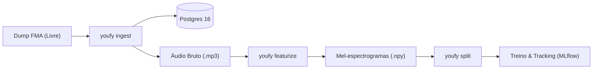

# Youfy

> Laboratório pessoal de inteligência artificial aplicada, estruturado na forma de um ecossistema musical para validação de ciclos completos de MLOps.

O **Youfy** existe para submeter modelos de Machine Learning a fluxos e cargas de produção reais: desde a ingestão de catálogo e extração determinística de features acústicas até treino rastreável, serving de baixa latência e observabilidade contínua.

---

## Proposta e Filosofia

O critério de sucesso do Youfy é a **profundidade em ML e MLOps**, não a amplitude de infraestrutura. Cada decisão do projeto prioriza:

- **Rigor na espinha dorsal de dados**: Imutabilidade, reprodutibilidade exata por commit e versão de dados via DVC.
- **Isolamento de fronteiras arquiteturais**: Pacotes desacoplados com direção estrita de dependências.
- **Invariantes testados por construção**: Proteções contra vazamento de dados (ex: disjunção estrita de artista nos splits) validadas matematicamente e via testes baseados em propriedades.
- **Prontidão para serving**: Validação estrita de compatibilidade de features em runtime para eliminar o temido *training/serving skew*.



---

## Estrutura do Monorepo

O código-fonte é organizado como um monorepo gerenciado com `uv`, composto por três pacotes principais e uma camada de orquestração:

| Pacote | Responsabilidade | Tecnologias |
|---|---|---|
| [`packages/audio`](pacotes/audio.md) | Funções puras sobre arrays (sem I/O de banco ou rede) | `librosa`, `soundfile`, `numpy` |
| [`packages/catalog`](pacotes/catalog.md) | Ingestão, modelos relacionais e persistência de metadados | `SQLAlchemy 2.0`, `Postgres 16`, `Alembic` |
| [`pipelines`](pacotes/pipelines.md) | CLI Typer, orquestração dos estágios offline e logging estruturado | `typer`, `structlog`, `dvc` |

---

## Começando Rápido

Para configurar o ambiente de desenvolvimento e executar a suíte de testes:

```bash
# Instala o workspace uv e dependências
make setup

# Inicializa o container do banco Postgres
make up

# Executa os 45 testes automatizados com cobertura
make test

# Executa o pipeline ponta a ponta sobre micro-dataset
make e2e
```

Acesse o [Guia de Início Rápido](guia/inicio-rapido.md) para detalhes completos de configuração.
