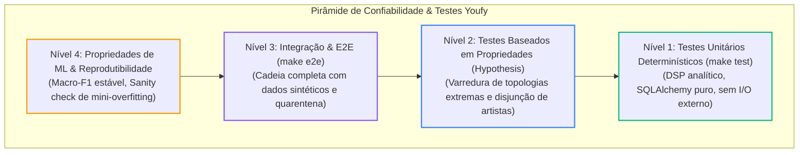

# Estratégia de Testes

Testes de software tradicionais não cobrem adequadamente os modos de falha de aprendizado de máquina. O Youfy estabelece uma pirâmide de testes em quatro níveis:

---

## 1. Testes Unitários Determinísticos

Rápidos, executados em memória e isolados de serviços externos:
- **`audio`:** Validação do pico em Hz com sinal analítico senoidal de 440 Hz; garantia de energia mínima para áudios nulos (silêncio); validação de coerência das dimensões e formato do espectrograma.
- **`catalog`:** Validação de integridade referencial do SQLAlchemy, unicidade de tuplas `(track_id, genre_id)` e parsing resiliente de formatos tabulares.
- **`split`:** Testes de invariantes lógicos e determinismo sob uma mesma semente aleatória.

---

## 2. Testes Baseados em Propriedades (Hypothesis)

Utiliza o framework **Hypothesis** para gerar aleatoriamente centenas de casos de borda e garantir invariantes matemáticos:
- Garantia de disjunção estrita entre conjuntos de artistas, independentemente da cardinalidade do catálogo musical.

---

## 3. Teste de Integração Ponta a Ponta (E2E)

Executado pelo comando `make e2e` (`pipelines/tests/test_pipeline_e2e.py`):
- Gera um micro-dump sintético dinâmico em diretório temporário (~25 faixas sintéticas com áudios válidos e corrompidos).
- Executa a cadeia completa: `ingest` $\rightarrow$ `featurize` $\rightarrow$ `split`.
- Valida que falhas técnicas foram isoladas na quarentena, que todos os arquivos `.npy` foram gravados com os formatos corretos e que a retomada de qualquer estágio ocorre sem reexecuções desnecessárias.

---

## 4. Testes de Propriedades de Machine Learning (Roadmap)

Planejados para as próximas fases do ciclo de treino:
- **Teste de Reprodutibilidade:** Mesma seed + mesma versão de dados $\rightarrow$ mesmo Macro-F1 dentro de $\pm 0{,}002$.
- **Overfitting Proposital:** Capacidade de atingir 100% de acurácia em um mini-batch de 50 amostras (separa bugs de código de problemas de arquitetura do modelo).
- **Rótulos Embaralhados:** Treino com rótulos aleatórios deve produzir acurácia próxima ao acaso ($\sim 12{,}5\%$ para 8 classes).

---

## Pirâmide de Testes e Confiabilidade MLOps

A pirâmide de qualidade do Youfy é projetada para capturar erros nas camadas mais rápidas e baratas antes da execução completa:

