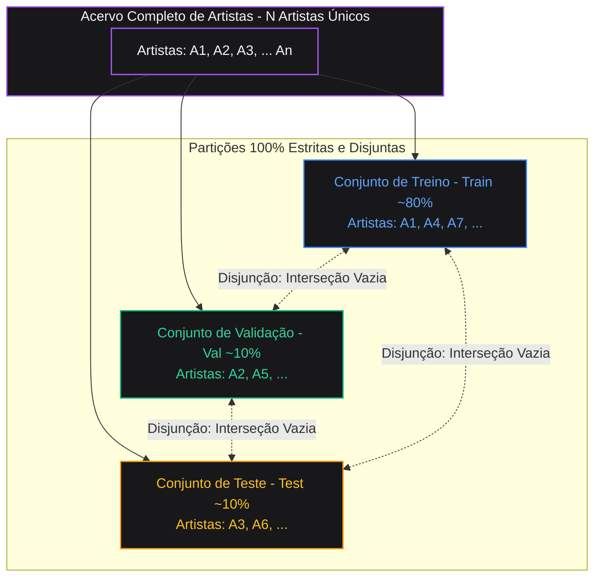
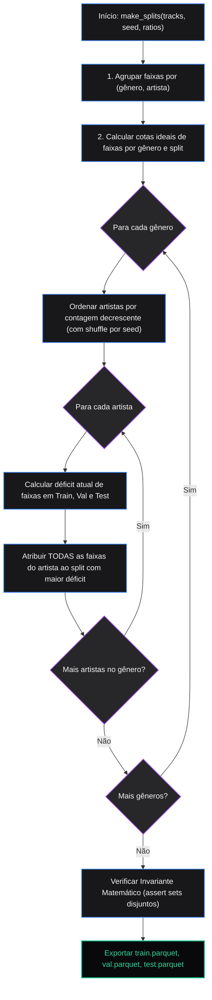

# Invariantes de ML: Disjunção por Artista

Um dos erros mais comuns e silenciosos em *Music Information Retrieval* (MIR) é a contaminação de artistas entre os conjuntos de treino e teste (*artist leak*).

---

## Por que a Disjunção de Artista é Crítica?

Modelos de áudio convolucionais possuem capacidade suficiente para memorizar assinaturas acústicas de produção musical:
- Tipo de microfone e equalização do vocalista.
- Compressor de masterização ou estúdio de gravação.
- Estilo específico de sintetizador ou timbre de guitarra.

Se o mesmo artista estiver presente tanto no conjunto de treino quanto no de teste, o modelo aprenderá a reconhecer a assinatura de produção do artista em vez das características universais do gênero musical. Como consequência:
- A acurácia no conjunto de teste inflará artificialmente.
- O modelo falhará drasticamente quando submetido a faixas de novos artistas em produção.

---

## O Invariante Matemático

Para todo particionamento gerado pelo Youfy:

$$\text{artistas}(\text{train}) \cap \text{artistas}(\text{val}) = \emptyset$$
$$\text{artistas}(\text{train}) \cap \text{artistas}(\text{test}) = \emptyset$$
$$\text{artistas}(\text{val}) \cap \text{artistas}(\text{test}) = \emptyset$$

---

## Implementação: Algoritmo Guloso por Déficit

A função `make_splits` no módulo `youfy_pipelines.split` opera da seguinte forma:

1. Agrupa as faixas por par `(gênero, artista)`.
2. Calcula as cotas ideais de faixas para cada conjunto (`train: 70%`, `val: 15%`, `test: 15%`).
3. Para cada gênero:
   - Ordena os artistas pelo número de faixas (desempatando por um embaralhamento reprodutível via `--seed`).
   - Atribui **todas** as faixas de um artista ao conjunto cujo déficit de faixas daquele gênero for maior no momento.
4. Como cada artista é processado de forma atômica, a disjunção é garantida **por construção**.

---

## Validação Baseada em Propriedades (Hypothesis)

Além dos testes unitários convencionais, o Youfy executa testes de propriedades via **Hypothesis** (`test_propriedade_disjuncao_de_artista_vale_para_qualquer_acervo`):
- Gera dezenas de catálogos sintéticos com topologias extremas (artistas com muitas faixas, artistas com uma única faixa, distribuições desbalanceadas de gêneros).
- Valida que o invariante de disjunção se mantém rigorosamente verdadeiro para qualquer acervo arbitrário.

