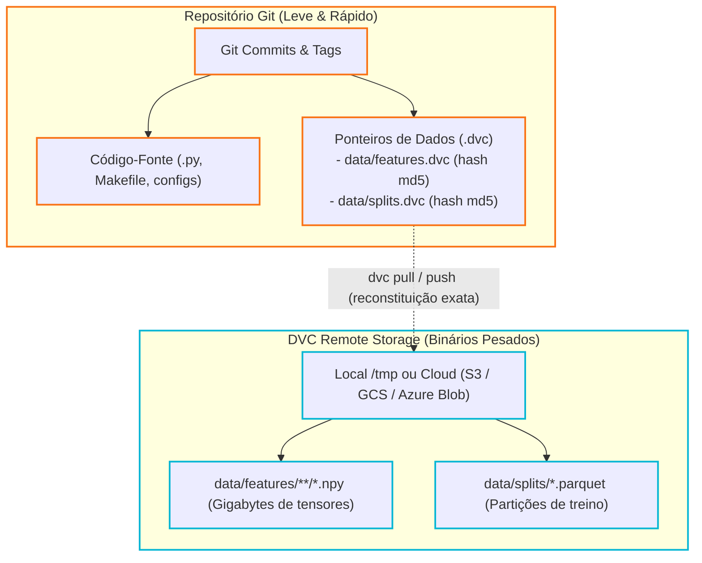

# Versionamento de Dados com DVC

O Youfy utiliza **DVC (Data Version Control)** para gerenciar artefatos binários pesados sem poluir o histórico do Git.

---

## O que é Versionado

| Diretório | Tipo de Conteúdo | Estratégia de Versionamento |
|---|---|---|
| `data/features/` | Mel-espectrogramas binários (`.npy`) | DVC (`data/features.dvc`) |
| `data/splits/` | Partições JSON dos conjuntos de dados | DVC (`data/splits.dvc`) |
| `data/raw/` | Dump original e arquivos MP3 brutos | Excluído pelo `.dvcignore` (rastreado pelo manifesto) |

---

## Remote Local e Configuração

O repositório é configurado com um remote local padrão:

```ini
# .dvc/config
[core]
    remote = local
['remote "local"']
    url = /tmp/youfy-dvc-remote
```

### Comandos de Operação

```bash
# Adiciona diretórios de features e splits ao DVC e envia ao remote
make dvc-push

# Ou manualmente via CLI:
uv run dvc add data/features data/splits
uv run dvc push
```

Quando novos dados são processados, apenas os arquivos ponteiro `*.dvc` correspondentes são comitados no Git, garantindo que qualquer commit do código possa restaurar exatamente o estado correspondente das matrizes de features.

---

## Separação Arquitetural: Git (Metadados) vs DVC (Binários)

O modelo de dados distribuído garante repositórios Git leves com rastreabilidade criptográfica de dados pesados:



