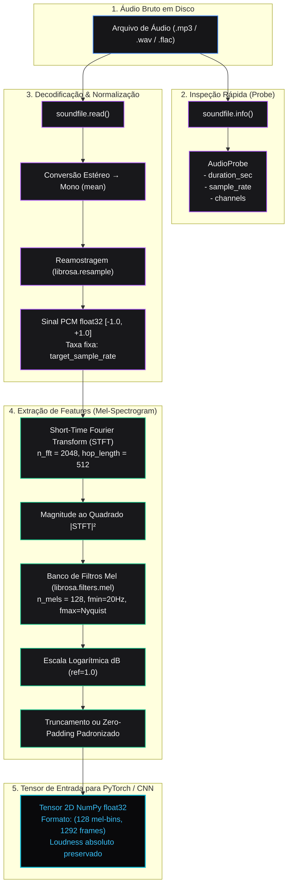

# Pacote `youfy-audio`

O pacote `packages/audio` é responsável por processamento de sinal digital (DSP) e decodificação acústica.

---

## Princípio de Design: Funções Puras

- **Sem dependência de banco de dados:** Não importa SQLAlchemy, modelos ou conexões.
- **Sem chamadas de rede ou I/O externo:** Opera exclusivamente sobre arquivos de áudio locais ou buffers na memória.
- **Testabilidade determinística:** Testado via sinais analíticos sintéticos (seno de 440 Hz, ruído branco, silêncio), sem fixtures binárias de dados externos.

---

## Módulos

### 1. `youfy_audio.spec`
Define a classe de configuração `FeatureSpec` com:
- `fingerprint() -> str`: Hash SHA-256 estável de 16 caracteres.
- `effective_fmax -> float`: Frequência de corte Nyquist padrão ($sr / 2$).

### 2. `youfy_audio.melspec`
Computa o mel-espectrograma em decibéis:

```python
def compute_melspec(
    samples: np.ndarray, 
    sample_rate: int, 
    spec: FeatureSpec
) -> np.ndarray:
    ...
```

- **Referência fixa (`ref=1.0`):** Não utiliza normalização por pico local (`np.max`), preservando o loudness absoluto e a consistência entre clipes.
- **Dimensões garantidas:** Ajusta automaticamente para `(spec.n_mels, spec.n_frames)` com padding padronizado para áudios menores que a janela esperada.

### 3. `youfy_audio.decode`
Decodificação de áudio para matrizes NumPy e inspeção leve:

- `probe(path: str | Path) -> AudioProbe`: Realiza a leitura rápida apenas do cabeçalho do arquivo via `soundfile`, extraindo duração, taxa de amostragem e número de canais sem carregar amostras na memória.
- `decode(path: str | Path, target_sample_rate: int) -> np.ndarray`: Decodifica arquivos para `float32` mono, realizando reamostragem automática para a frequência de destino.

### 4. `youfy_audio.errors`
- `UnreadableAudio`: Exceção tipada lançada quando um arquivo está ausente, corrompido, truncado ou em formato não decodificável.

---

## Fluxo do Pipeline Acústico (DSP)

O diagrama abaixo ilustra o ciclo de vida da transformação desde o arquivo de áudio bruto no disco até a matriz tensorial pronta para o classificador:


