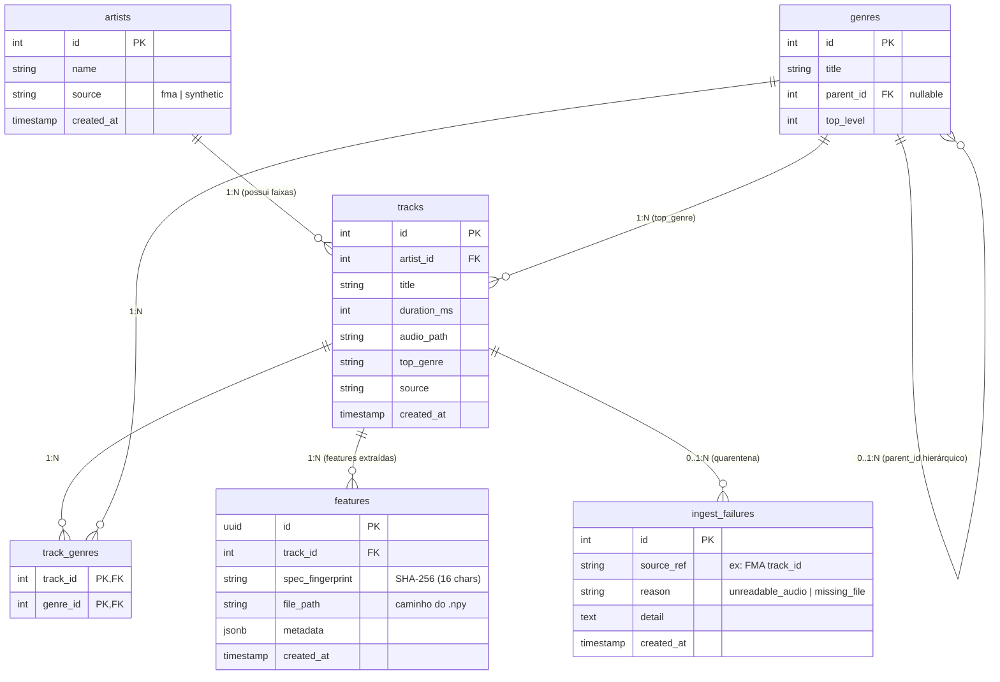

# Pacote `youfy-catalog`

O pacote `packages/catalog` gerencia o esquema relacional, persistência, leitura do dataset FMA e rastreabilidade de integridade do catálogo musical.

---

## Modelos de Dados (SQLAlchemy 2.0)

O catálogo é modelado com SQLAlchemy 2.0 `DeclarativeBase`:

| Tabela | Modelo | Descrição |
|---|---|---|
| `artists` | `Artist` | Artistas musicais e identificador de origem (`source='fma'`) |
| `genres` | `Genre` | Árvore de gêneros hierárquicos com suporte a `parent_id` |
| `tracks` | `Track` | Faixas musicais com título, duração em ms, caminho local e gênero principal |
| `track_genres` | `TrackGenre` | Relacionamento N:N entre faixas e gêneros adicionais |
| `ingest_failures` | `IngestFailure` | Tabela de quarentena: rastreia falhas de leitura ou dados ausentes |
| `features` | `Feature` | Registros de extração de features associadas a um `spec_fingerprint` |

---

## Repositório Idempotente

Módulo `youfy_catalog.repository`:

- `upsert_artist(session, *, id, name, source)`: Insere ou atualiza o artista via `ON CONFLICT DO UPDATE`.
- `upsert_track(session, *, id, artist_id, title, duration_ms, audio_path, top_genre, source)`: Upsert idempotente de faixas.
- `record_failure(session, *, source_ref, reason, detail)`: Registra faixas problemáticas na quarentena sem interromper o pipeline.

---

## Leitor do Dump FMA (`youfy_catalog.fma`)

Lida com as peculiaridades do formato original do Free Music Archive:
- **Cabeçalho de dois níveis:** Faz o parse correto de `tracks.csv` com MultiIndex do Pandas (`set/subset`, `track/title`, etc.).
- **Particionamento por milhar:** Mapeia faixas como `001005` para a pasta `001/001005.mp3` através de `audio_path_for(track_id, audio_root)`.

---

## Migrations com Alembic

O esquema é versionado através de revisões automáticas no Alembic:

```bash
# Aplica todas as migrations pendentes
uv run alembic upgrade head

# Verifica se o modelo SQLAlchemy está 100% alinhado com o banco
uv run alembic check
```

---

## Diagrama Entidade-Relacionamento (ERD)

Abaixo está a arquitetura relacional do banco PostgreSQL, destacando as chaves estrangeiras, a quarentena de falhas e os artefatos de features indexados por fingerprint:


