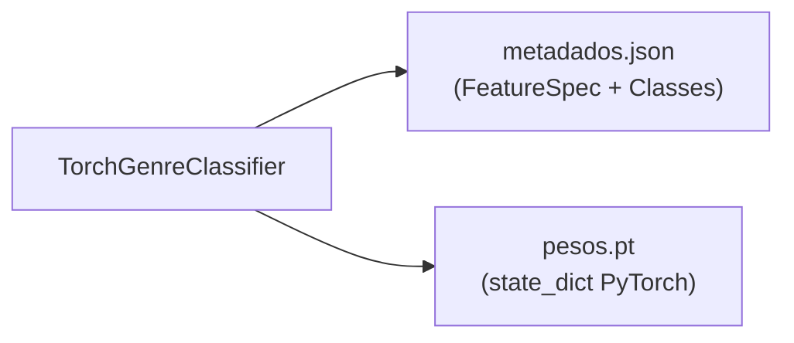
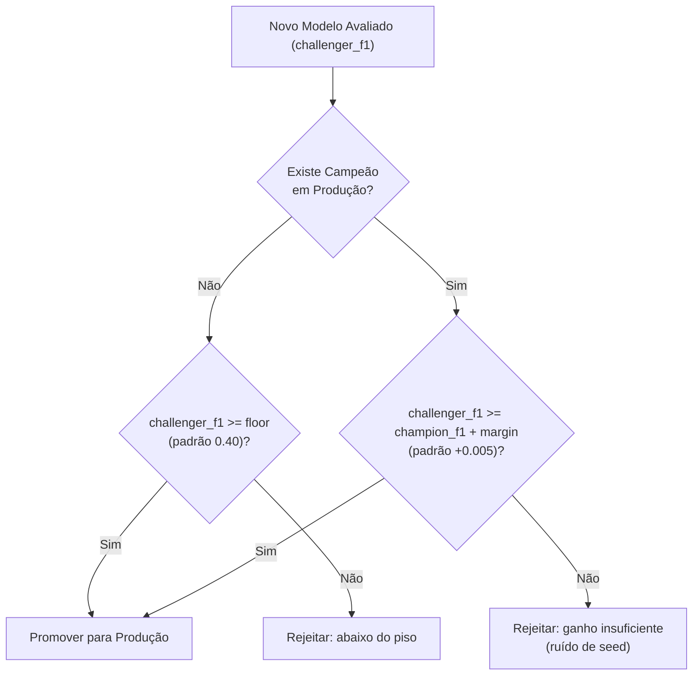

# Pacote `youfy-ml`

O pacote `youfy-ml` implementa o treinamento, modelagem, avaliação e contrato de artefato do classificador de gênero musical do Youfy.

Ele opera sob uma fronteira estrita: **não depende de `catalog`, `serving` nem `pipelines`**, consumindo exclusivamente matrizes de espectrograma (`.npy`) e contratos de especificação técnica de `youfy-audio`.

---

## 1. Contrato do Artefato (`artifact.py`)

Para erradicar riscos de incompatibilidade e serializações frágeis (`pickle`), o Youfy adota um contrato de artefato padronizado e determinístico:



- **`GenreClassifier` (Protocol)**: Define `predict(melspec: np.ndarray) -> np.ndarray` (devolvendo distribuição normalizada via softmax) e propriedades `spec: FeatureSpec` e `classes: tuple[str, ...]`.
- **`TorchGenreClassifier`**: Implementação concreta encapsulando a rede PyTorch, capaz de salvar e carregar em disco em pasta isolada contendo `metadados.json` e `pesos.pt`. Rejeita na inferência matrizes de espectrograma que não correspondam exatamente ao shape `(n_mels, n_frames)` da spec técnica.

---

## 2. Dataset Desacoplado (`dataset.py`)

O `MelspecDataset` lê matrizes `.npy` persistidas em disco sem realizar consultas SQL durante o loop de treino:

```python
from youfy_ml.dataset import LabeledTrack, MelspecDataset

dataset = MelspecDataset(
    features_dir=Path("data/features/melspec/<fingerprint>"),
    samples=[
        LabeledTrack(track_id="fma:track:1", genre="Rock"),
        LabeledTrack(track_id="fma:track:2", genre="Jazz"),
    ],
    classes=("Jazz", "Rock"),
)
```

- **Identificação Canônica de Classes**: O índice do rótulo segue a ordenação lexicográfica imutável da tupla `classes`.
- **Validação Antecipada**: Falhas na leitura de arquivos ou matrizes ausentes levantam `MissingFeature` com o identificador da faixa e caminho do arquivo.

---

## 3. Arquitetura Invariante a Dimensões (`model.py`)

A rede `GenreCNN` é uma CNN projetada para classificação espectral que desacopla a arquitetura das dimensões do melspectrograma:

- **4 Blocos Convolucionais**: Conv2d $\rightarrow$ BatchNorm2d $\rightarrow$ ReLU $\rightarrow$ MaxPool2d(2, 2).
- **Pooling Adaptativo**: `nn.AdaptiveAvgPool2d(1)` colapsa as dimensões espaciais e temporais `(n_mels, n_frames)` para `(1, 1)` antes da camada linear final, permitindo alterar `n_mels` ou `n_frames` sem quebrar dimensões de camadas densas.
- **Dropout Estruturado**: Taxa de dropout de 0.25 para mitigar sobreajuste.

---

## 4. Semeadura Determinística (`seeding.py`)

O Youfy implementa repetibilidade completa entre experimentos:

- **`set_seed(seed)`**: Semeia simultaneamente `torch`, `torch.cuda`, `numpy` e Python `random`, e habilita `torch.use_deterministic_algorithms(True)` com `torch.backends.cudnn.deterministic = True`.
- **`seeded_generator(seed)`**: Cria geradores `torch.Generator` para controle de amostragem nos `DataLoader`.

---

## 5. Loop de Treino e Validação (`train.py`)

O módulo `train.py` executa o loop com medição por época e cálculo de métricas:

- **Otimizador**: `AdamW(lr=1e-3, weight_decay=1e-4)`.
- **Função de Perda**: `nn.CrossEntropyLoss()`.
- **Determinismo**: Exige `num_workers=0` caso determinismo estrito seja requisitado, prevenindo condições de corrida não-determinísticas entre workers.

---

## 6. Métricas e Shuffled Labels (`evaluate.py`)

Métricas de classificação calculadas de forma pura com NumPy e Scikit-Learn:
- Macro-F1 e Micro-F1.
- Acurácia global e Cross-Entropy Loss.
- **Teste de Rótulos Embaralhados**: Valida que, sob embaralhamento de rótulos com 8 classes balanceadas, o Macro-F1 fica abaixo de 0.20 (faixa do acaso puro de 0.125), garantindo ausência de vazamento de sinal.

---

## 7. Gate de Promoção Codificado (`promotion.py`)

O módulo `promotion.py` toma decisões determinísticas de aceitação de modelos desafiantes (*challengers*) contra o campeão em produção (*champion*):



---

## 8. Tracking no MLflow (`tracking.py`)

- Registra hiperparâmetros, métricas por época (`train_loss`, `train_acc`, `val_loss`, `val_macro_f1`).
- Salva o artefato `TorchGenreClassifier` diretamente no run.
- Registra a versão no **MLflow Model Registry**.
- Usa o **alias moderno `production`** para gerenciar a versão ativa, substituindo os antigos *stages* descontinuados no MLflow.
