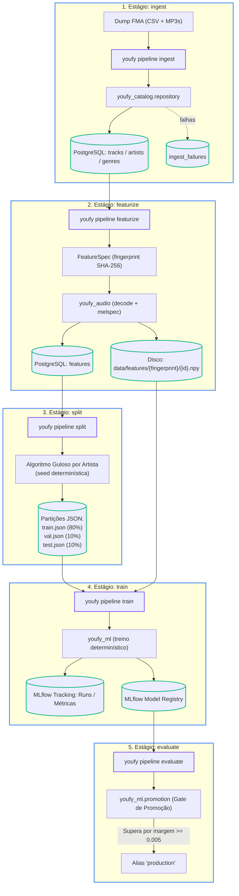

# Pacote `youfy-pipelines`

O pacote `pipelines` é a camada de orquestração do Youfy. É o **único componente autorizado a compor `youfy-audio` e `youfy-catalog`**.

---

## CLI Canônica (`youfy`)

Construída com **Typer**, a interface de linha de comando é o ponto de entrada oficial para todas as operações offline do Youfy:

```bash
# Ajuda geral dos estágios
youfy pipeline --help

# Ingestão do acervo
youfy pipeline ingest --dump-dir ./data/raw/fma --subset small

# Extração de mel-espectrogramas
youfy pipeline featurize --n-mels 128 --hop-length 512

# Particionamento estratificado agrupado por artista
youfy pipeline split --seed 42

# Treinamento do classificador com tracking no MLflow
youfy pipeline train --epochs 10 --batch-size 32 --seed 42

# Avaliação do modelo e gate de promoção
youfy pipeline evaluate --version 1 --margin 0.005 --floor 0.40
```

---

## Logging Estruturado em JSON (`structlog`)

Seguindo as melhores práticas para observabilidade e rastreabilidade:
- Eventos e métricas emitidos em JSON estruturado com timestamps ISO em UTC.
- Compatível com coletores modernos de logs (FluentBit, Vector, Datadog).

Exemplo de log emitido:

```json
{
  "event": "ingest.concluido",
  "level": "info",
  "timestamp": "2026-09-18T22:30:00.000000Z",
  "total": 8000,
  "ingeridas": 7994,
  "falhas": 6,
  "taxa_de_falha": 0.0008
}
```

---

## Fluxo de Orquestração dos Pipelines Offline

O pacote `youfy-pipelines` coordena os 3 estágios determinísticos, conectando o catálogo relacional ao armazenamento de matrizes e partições de ML:


