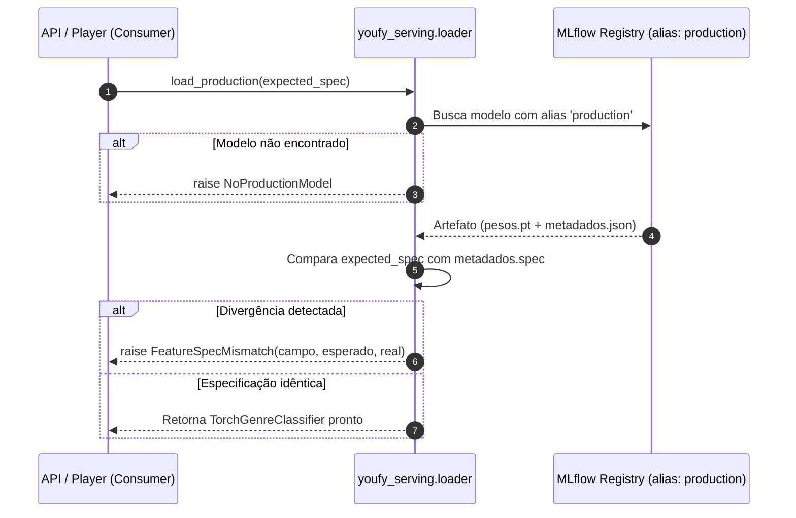

# Pacote `youfy-serving`

O pacote `youfy-serving` é responsável pelo carregamento e predição do classificador em tempo de execução, garantindo isolamento arquitetural e proteção ativa contra **training/serving skew**.

Ele consome artefatos registrados no MLflow Model Registry e expõe uma API de inferência enxuta e tipada.

---

## 1. Princípios Arquiteturais

- **Zero dependência de treino**: O `serving` desconhece loops de treinamento, otimizadores e datasets de treino (`youfy-ml` é usado apenas para a definição do protocolo `GenreClassifier` e carregamento do artefato).
- **Sem acesso ao banco relacional**: O `serving` não consulta o catálogo PostgreSQL.
- **Fail-Fast na Inicialização**: Se o modelo promovido foi treinado com parâmetros de áudio divergentes da especificação consumida, o serviço **recusa-se a iniciar**.

---

## 2. Deteção de Skew no Boot (`loader.py`)

A maior fonte de erros silenciosos em sistemas de áudio com ML ocorre quando o extrator de features em produção usa hiperparâmetros diferentes daqueles usados no treino (ex: taxa de amostragem, número de filtros mel ou tamanho do salto de frames).

O `youfy-serving` impede essa anomalia comparando a `FeatureSpec` esperada pelo consumidor contra os metadados embutidos no artefato:

```python
from youfy_audio.spec import FeatureSpec
from youfy_serving.loader import load_production

# Especificação técnica adotada no serviço
spec_esperada = FeatureSpec(sample_rate=22050, n_mels=128, hop_length=512, n_frames=1292)

# Carrega o modelo marcado com o alias 'production' no MLflow Registry
classificador = load_production(
    tracking_uri="http://localhost:5000",
    model_name="youfy-genre-cnn",
    expected_spec=spec_esperada,
)
```

### Exceções Tipadas (`errors.py`)

- **`NoProductionModel`**: Lançada quando não há nenhuma versão registrada com o alias `production` no registry do MLflow.
- **`FeatureSpecMismatch`**: Lançada quando qualquer campo da especificação (`sample_rate`, `n_mels`, `n_fft`, `hop_length`, `n_frames`) divergir dos metadados do modelo.



---

## 3. Predição Tipada (`predictor.py`)

O preditor encapsula a execução da inferência:

```python
from youfy_serving.predictor import Predictor

preditor = Predictor(classificador)
resultado = preditor.predict(melspec_array)

print(f"Versão do Modelo: {resultado.model_version}")
print(f"Top Gênero: {resultado.top_genre}")
print(f"Probabilidade: {resultado.confidence:.2%}")
print(f"Distribuição: {resultado.distribution}")
```

### Contrato de Saída (`Prediction`):

| Campo | Tipo | Descrição |
| :--- | :--- | :--- |
| `top_genre` | `str` | Classe de maior probabilidade segundo o modelo (`argmax`). |
| `confidence` | `float` | Probabilidade associada ao top gênero ($0.0 \dots 1.0$). |
| `distribution` | `dict[str, float]` | Dicionário mapeando cada gênero à sua probabilidade softmax. |
| `model_version` | `str \| None` | Versão do modelo registrada no MLflow. |
